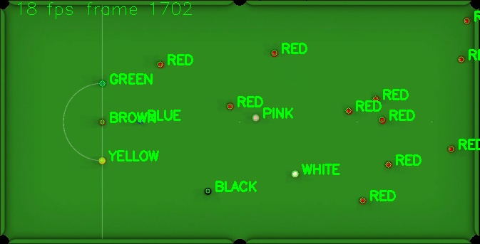

# Snooker Ball Tracker

This is a CLI prototype that I developed in Python 3 to demo an idea I had for an app that could automatically detect and track Snooker balls on a Snooker table.

The app would therefore be able to automatically score points based upon which ball was potted.

## Examples

`python ball_tracker_cli.py -i ../../resources/images/image-1.jpg --settings image-1`

`python ball_tracker_cli.py -i ../../resources/images/image-2.jpg --settings image-2 --crop`

`python ball_tracker_cli.py -v ../../resources/videos/pre-recorded-1.mp4 --settings pre_recorded_footage --crop`

</img>