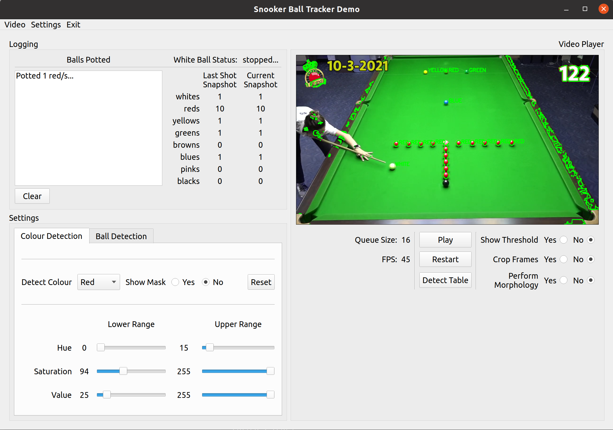

# Snooker Ball Tracker

This project is a prototype that I developed in Python to demo an idea I had for a program that could automatically detect and track Snooker balls on a Snooker table. The program would therefore be able to automatically score points based upon which ball was potted.

The program allows you to configure all the settings that are used by the ball tracker, from how it detects colours to how it detects balls. It also provides features that allows you to see what the ball trackers sees. 

## Requirements
- [Python](https://www.python.org/) version 3.8
- [Poetry](https://python-poetry.org/) version 1.5.0

### From source

- Run `poetry install` to install all required modules and dependencies
- Run `poetry shell` to activate the python virtual environment;
- Run `sbt-image` to run the image CLI or;
- Run `sbt-video` to run the main video GUI

### From an executable

- Run `poetry install` to install all required modules and dependencies
- Run `poetry shell` to activate the python virtual environment;
- Run `python build.py` to create single file executable (Bundles Video GUI only)
- Generated executable should be available in `dist/`

## Video GUI Examples
The Video GUI provides an interface to allow you to configure the ball tracker in real-time as the app
is processing video. Currently only supports pre-recorded video.

### Interface screenshot

</img>

### Video Example

</img>

## Image CLI Examples
The Image CLI supports processing images.

### Image 1
    sbt-image resources/images/image-1.jpg --settings resources/config/image_1.json

</img>

### Image 2
    sbt-image resources/images/image-2.jpg --settings resources/config/image_2.json

</img>
